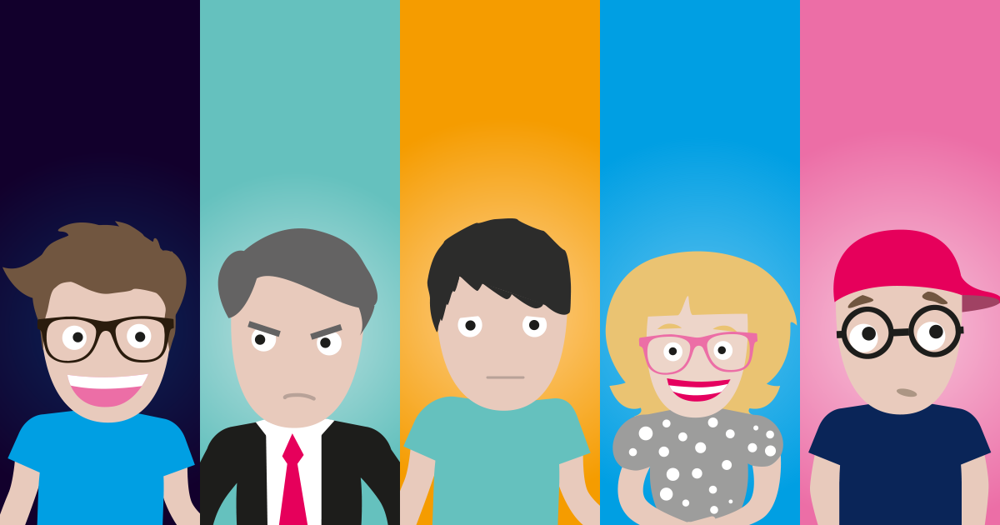

** AI Project Landing Page **

A clean and modern AI-themed landing page built using **HTML5** and **Tailwind CSS**. This project was created as a frontend practice project to recreate a professional SaaS-style hero section with a modern user interface, call-to-action buttons, floating dashboard cards, and an attractive gradient background.

The landing page is designed to showcase how AI and productivity-focused products present information in a visually engaging and user-friendly manner.

** Features **

1. Modern and responsive navigation bar
2. AI-focused hero section
3. Call-to-action buttons
4. Floating dashboard cards
5. Task tracking widget
6. Project status widget
7. Team activity widget
8. Beautiful gradient background
9. Font Awesome icons integration
10. Clean and minimal UI design
11. Built with Tailwind CSS utility classes

** Technologies Used **

1.HTML5
2.Tailwind CSS
3.Font Awesome

** Navigation Bar **

The navigation bar includes:

1. Brand logo
2. Product link
3. Solutions link
4. Resources link
5. Pricing link
6. Login option
7. Primary CTA button

** How to Run the Project **

1. Clone the Repository
2. Navigate to the Project Folder
3. Open the Project
4. open the `index.html` file in your browser.

<!doctype html>
<html lang="en">
  <head>
    <meta charset="UTF-8" />
    <meta name="viewport" content="width=device-width, initial-scale=1.0" />
    <title>Hero Landing Page</title>
    <link
      rel="stylesheet"
      href="https://cdnjs.cloudflare.com/ajax/libs/font-awesome/6.7.2/css/all.min.css"
    />
    
  </head>
  <body class="font-sans m-0 p-0 overflow-y-hidden">
    <header>
      

        
        
Project

        

          <a class="px-2" href="#">Product</a>
          <a class="px-2" href="#">Solutions</a>
          <a class="px-2" href="#">Resources</a>
          <a class="px-2" href="#">Pricing</a>
          <a class="px-2 font-bold" href="#">Log in</a>
        

        

          <button class="bg-black w-30 p-3 rounded text-white cursor-pointer">
            Get AI free
          </button>
        

      

    </header>
    <section
      class="bg-gradient-to-r from-[#ffe7d0f9] to-white min-h-screen relative"
    >
      

        <h1 class="font-bold text-3xl mt-2">
          Write, plan, share.  With AI at your
          side.
        </h1>
      

      

        

          It is the connected workspace where better,faster work happens.Now
          with AI.
        

      

      

        <button class="bg-black p-3 rounded text-white cursor-pointer">
          Get AI free <i class="fa-solid fa-arrow-right"></i>
        </button>
        <button class="bg-blue-600 p-3 rounded text-white cursor-pointer">
          Request a demo
        </button>
      

      

        <i
          class="flex place-content-center h-10 w-10 fa-solid fa-book card-icon text-pink-400 bg-pink-200 rounded mx-2 my-2 pl-2"
        ></i
        >Tasks
        
12 tasks completed today.

      

      

        
      

      

        <i
          class="fa-solid fa-check project-icon flex place-content-center mt-2 ml-2 pl-1 text-green-400 bg-green-200 rounded h-10 w-8"
        ></i>
        

          Project status  
          On Track
        

      

      

        

          Team Activity
          
        

         +5 online
      

      

        <i class="fa-solid fa-comment text-lg ml-2 mt-2"></i>
      

    </section>

  </body>
</html>
